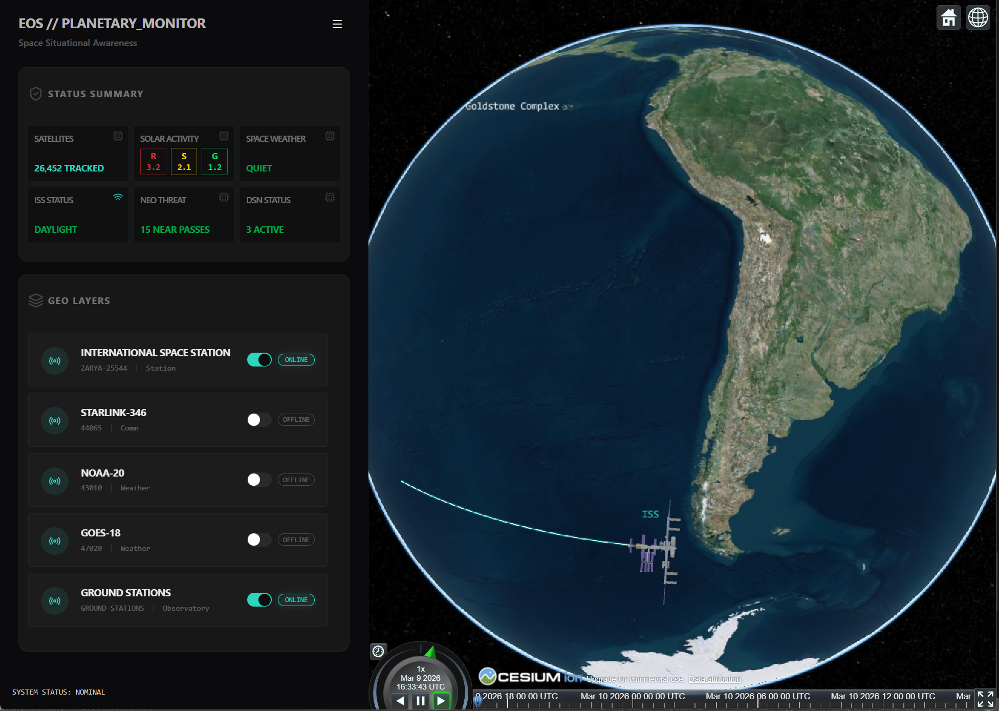

# 🌍 EOS – Planetary Monitor

A real-time planetary monitoring dashboard built with **Vue 3** and **CesiumJS**.

It visualizes satellite data, space weather, and orbital objects on a 3D globe. The goal of the project is to experiment with **geospatial visualization, realtime data streams, and modern UI architecture**.



---

# Overview

EOS is a dashboard-style interface for monitoring things happening around Earth — satellites, the ISS, solar activity, and near-earth objects.

It combines live data sources with orbital simulations when live telemetry isn't available.

This project is mainly a **technical playground for building high-performance geospatial interfaces**, not an official monitoring tool.

---

# Features

- 🌍 **3D Globe Visualization** powered by CesiumJS
- 🛰 **Satellite Tracking** including the ISS
- ☀️ **Solar Activity Monitoring** (NOAA scales)
- ☄ **Near Earth Object indicators**
- 🔄 **Fallback simulations** when live data isn't available
- 🎛 **Dashboard UI** designed for quick situational awareness

---

# Tech Stack

## Frontend

- Vue 3 (Composition API + TypeScript)
- Vite
- CesiumJS

## UI & Styling

- **Tailwind CSS 4**: Modern, high-performance styling engine.
- **Shadcn-Vue / Reka UI**: Accessible, headless component primitives.
- **Lucide Icons**: Consistent, technical iconography.

## Utilities

- VueUse
- PNPM Workspaces

---

# Running the Project

## Requirements

- Node.js (LTS)
- PNPM

## Install

```bash
git clone https://github.com/your-repo/eos-planetary-monitor.git
cd eos-planetary-monitor
pnpm install
```

## Start development server

```bash
pnpm dev:vue
```

---

# Data Sources

The project pulls data from several public APIs:

- NASA NEO (Near-Earth Objects)
- NOAA Space Weather Prediction Center
- WhereTheISS API

---

# Project Goals

This project explores:

- real-time geospatial interfaces
- satellite orbit visualization
- resilient data layers with fallbacks
- modern Vue architecture patterns

### Planned

- [ ] **React Interface**: A parallel implementation of the EOS dashboard.
- [ ] **Shared Core**: Shared logic and assets across frameworks.

---

# License

MIT © Alessa M
